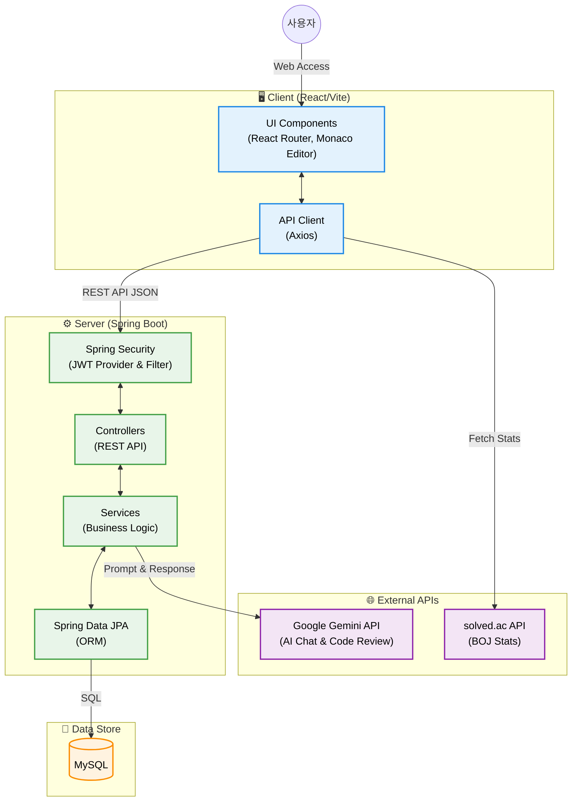

# 🚀 UpMe

> AI 기반 코딩 테스트 · 영어 회화 · 단어 학습 플랫폼

---

## 📖 프로젝트 소개

UpMe는 **코딩 테스트 준비**, **AI 영어 회화 연습**, **단어 학습**을 하나의 플랫폼에서 제공하는 종합 학습 서비스입니다.  
백준 문제를 풀 수 있는 코딩 환경, AI와의 실시간 영어 대화, 그리고 매일 새로운 단어 학습을 통해 꾸준한 성장을 지원합니다.

---

## ✨ 주요 기능

### � 코딩 테스트
- Monaco Editor 기반 IDE 스타일 코딩 환경
- 난이도별 · 카테고리별 문제 탐색
- 백준(BOJ) 연동으로 solved.ac 풀이 현황 확인
- 풀이 완료 문제 체크 표시

### 💬 AI 회화 연습
- AI와 실시간 영어 대화 연습
- 대화 세션 관리 및 히스토리

### 📚 단어 학습
- **오늘의 단어**: 1,000개 단어 DB에서 매일 새로운 단어 제공
- **나만의 단어장**: 마음에 드는 단어 저장 & 복습
- � 발음 듣기 (Web Speech API)
- Excel (`.xlsx`) 파일에서 자동 파싱하여 DB 적재

### �👤 마이페이지
- 학습 통계 대시보드 (학습 시간, 연속 출석, 정답률 등)
- 주간 학습 그래프
- 최근 활동 내역
- 프로필 편집 (이름, 전화번호, 백준 아이디)
- 백준 프로필 연동 (solved.ac 티어, 레이팅, 풀이 수 등)

### 🏆 등급 시스템
연속 출석일에 따른 자동 등급 부여:

| 등급 | 명칭 | 출석 기준 | 아이콘 |
|:---:|------|---------|:---:|
| 1 | 뉴비 (Newbie) | 가입 ~ 6일 | 🌱 |
| 2 | 러너 (Runner) | 누적 7~29일 | 🏃 |
| 3 | 프로 (Pro) | 누적 30일 이상 | 💎 |
| 4 | 마스터 (Master) | 누적 50일 이상 | 🏅 |
| 5 | 레전드 (Legend) | 연속 100일 이상 | 👑 |

### 🔐 인증 & 보안
- JWT 기반 회원가입 / 로그인 / 로그아웃
- 비로그인 게스트 접근 지원 (데이터 저장 기능은 로그인 필요)
- 비로그인 시 마이페이지 접근 → 로그인 페이지로 자동 리다이렉트
- 회원 탈퇴 기능

---

## 🛠️ 기술 스택

### Frontend
| 기술 | 용도 |
|------|------|
| **React 18** | UI 라이브러리 |
| **Vite 6** | 빌드 도구 |
| **React Router v7** | SPA 라우팅 |
| **Monaco Editor** | 코드 에디터 |
| **Axios** | HTTP 클라이언트 |
| **Web Speech API** | 단어 발음 재생 |

### Backend
| 기술 | 용도 |
|------|------|
| **Spring Boot 3.2** | 웹 프레임워크 |
| **Java 17** | 언어 |
| **Spring Security** | 인증/인가 |
| **JWT (jjwt 0.12)** | 토큰 기반 인증 |
| **Spring Data JPA** | ORM |
| **MySQL** | 데이터베이스 |
| **Apache POI** | Excel 파싱 (단어 데이터) |
| **Lombok** | 보일러플레이트 제거 |

---

## 🏗️ 시스템 아키텍처



---

## 📁 프로젝트 구조

```
UpMe/
├── frontend/                    # React 프론트엔드
│   ├── src/
│   │   ├── components/          # 공통 컴포넌트
│   │   │   ├── Header.jsx       # 상단 헤더
│   │   │   ├── Sidebar.jsx      # 사이드바 네비게이션
│   │   │   ├── CodeEditor.jsx   # Monaco 에디터 래퍼
│   │   │   ├── AuthContext.jsx  # 인증 상태 관리
│   │   │   ├── ToastContext.jsx # 토스트 알림
│   │   │   └── LoginPromptModal.jsx # 로그인 유도 모달
│   │   ├── pages/               # 페이지 컴포넌트
│   │   │   ├── HomePage.jsx         # 랜딩 페이지
│   │   │   ├── LoginPage.jsx        # 로그인
│   │   │   ├── RegisterPage.jsx     # 회원가입
│   │   │   ├── MyPage.jsx           # 마이페이지 (통계/프로필)
│   │   │   ├── CodingListPage.jsx   # 코딩 문제 목록
│   │   │   ├── CodingPage.jsx       # 코딩 테스트 IDE
│   │   │   ├── ConversationPage.jsx # AI 회화 목록
│   │   │   ├── ChatRoom.jsx         # AI 채팅방
│   │   │   ├── DailyWordPage.jsx    # 오늘의 단어
│   │   │   └── WordBookPage.jsx     # 나만의 단어장
│   │   ├── services/            # API 서비스 레이어
│   │   │   ├── api.js               # Axios 인스턴스 설정
│   │   │   ├── authService.js       # 인증 API
│   │   │   ├── userService.js       # 사용자 프로필 API
│   │   │   ├── codingService.js     # 코딩 테스트 API
│   │   │   ├── chatService.js       # 채팅 API
│   │   │   ├── conversationService.js# DB 기반 AI 대화 세션 관리
│   │   │   ├── wordService.js       # 단어 저장/조회 API
│   │   │   └── solvedacService.js   # solved.ac 연동 API
│   │   ├── App.jsx              # 라우팅 설정
│   │   ├── index.css            # 글로벌 스타일 & 디자인 시스템
│   │   └── main.jsx             # 엔트리포인트
│   ├── package.json
│   └── vite.config.js
│
├── backend/                     # Spring Boot 백엔드
│   ├── src/main/java/com/upme/
│   │   ├── UpMeApplication.java     # 메인 애플리케이션
│   │   ├── config/
│   │   │   ├── SecurityConfig.java  # Spring Security 설정
│   │   │   └── WordDataLoader.java  # Excel → DB 단어 로더
│   │   ├── controller/
│   │   │   ├── AuthController.java  # 회원가입/로그인/로그아웃
│   │   │   ├── UserController.java  # 프로필 조회/수정/탈퇴
│   │   │   ├── WordController.java  # 단어 API
│   │   │   ├── ConversationController.java # 대화방 생성/조회/삭제
│   │   │   ├── CodeReviewController.java # 코드 리뷰 API (Gemini)
│   │   │   ├── HealthController.java # 헬스체크
│   │   ├── model/
│   │   │   ├── User.java            # 사용자 엔티티
│   │   │   ├── UserActivity.java    # 사용자 활동/통계 엔티티
│   │   │   ├── Conversation.java    # AI 대화 세션 엔티티
│   │   │   ├── ChatMessage.java     # 대화 내 메시지 엔티티
│   │   │   ├── Word.java            # 단어 엔티티
│   │   │   └── SavedWord.java       # 저장 단어 엔티티
│   │   ├── dto/                     # 요청/응답 DTO
│   │   ├── repository/              # JPA 리포지토리
│   │   ├── service/                 # 비즈니스 로직 (GeminiService 등)
│   │   └── security/
│   │       ├── JwtTokenProvider.java     # JWT 토큰 생성/검증
│   │       └── JwtAuthenticationFilter.java # JWT 인증 필터
│   ├── src/main/resources/
│   │   └── words.xlsx               # 단어 데이터 (1,000개) - 추후 데이터 추가 예정
│   └── build.gradle
│
└── README.md
```

---

## 🚀 시작하기

### 사전 준비
- **Node.js** 18+
- **Java** 17+
- **MySQL** 8.0+

### Frontend 실행
```bash
cd frontend
npm install
npm run dev
```
> 기본: `http://localhost:5173`

### Backend 실행
```bash
cd backend

# application.properties에 DB 정보 설정 후
./gradlew bootRun
```
> 기본: `http://localhost:8080`

---